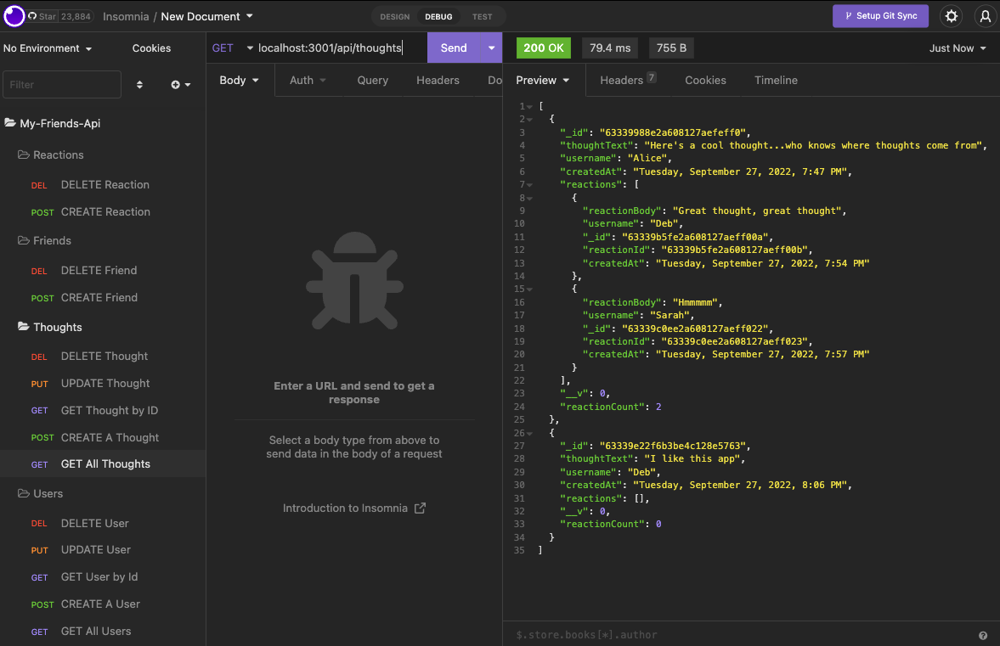

# My Friends API

  

## Description 
A social network api built with mongoDb, mongoose, and express.

## Table of Contents
* [Installation](#installation)
* [Usage](#usage)
* [Questions](#questions)
  
## Installation
  ~~~
  npm i
  ~~~
## Usage
Routes are tested with Insomnia. 

Watch a demo of the app here: https://watch.screencastify.com/v/1shP155gnS4mZMWekD2m

Get All Route for Thoughts

Get User by ID

Create Reaction

## Questions

Contact me at madalyne@madalynecross.com with any questions. View more of my work here: [violanerd](https://github.com/violanerd).

